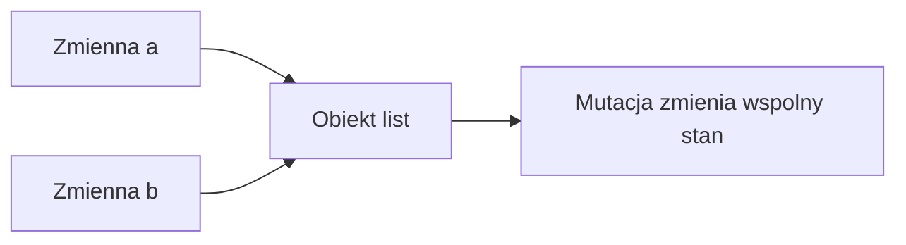

# Wykład 15: Referencje, mutowalność i niemutowalność w Pythonie

Python nie operuje na "kopiach obiektów" przy zwykłym przypisaniu. Zmienne przechowują referencje do obiektów. To, razem z rozróżnieniem między obiektami mutowalnymi i niemutowalnymi, jest krytyczne dla poprawnego rozumienia stanu programu.

## 1. Referencje do obiektów

```python
a = [1, 2, 3]
b = a
b.append(4)
print(a)  # [1, 2, 3, 4]
```

`a` i `b` wskazują na ten sam obiekt.

## 2. Mutowalne vs niemutowalne

### Niemutowalne
- `int`
- `float`
- `str`
- `tuple`
- `frozenset`

### Mutowalne
- `list`
- `dict`
- `set`
- większość własnych klas

Dlaczego to ważne?
- obiekty mutowalne mogą zmieniać stan bez zmiany referencji,
- obiekty niemutowalne zwykle "zastępujemy" nowym obiektem.

## 3. Argumenty funkcji

Python przekazuje referencję do obiektu. Skutki zależą od mutowalności obiektu.

```python
def append_item(items: list[int]) -> None:
    items.append(99)
```

Jeśli przekażesz listę do funkcji, funkcja może zmienić jej zawartość.

## 4. Mutowalne argumenty domyślne

Klasyczna pułapka:

```python
def add_item(value: int, items: list[int] = []) -> list[int]:
    items.append(value)
    return items
```

Lepsza wersja:

```python
def add_item(value: int, items: list[int] | None = None) -> list[int]:
    if items is None:
        items = []
    items.append(value)
    return items
```

## 5. Kopiowanie

```python
import copy

data = [[1, 2], [3, 4]]
shallow = copy.copy(data)
deep = copy.deepcopy(data)
```

- `copy.copy` - kopia płytka,
- `copy.deepcopy` - kopia głęboka.

## 6. Przykład kopii płytkiej i głębokiej

```python
import copy

matrix = [[1, 2], [3, 4]]
shallow = copy.copy(matrix)
deep = copy.deepcopy(matrix)

matrix[0].append(99)

print(shallow)  # zmiana widoczna
print(deep)     # bez zmiany
```

## 7. Tożsamość obiektu i `is`

```python
a = None
if a is None:
    print("Brak wartosci")
```

`is` porównuje tożsamość, a `==` porównuje równość logiczną.

Przykład:

```python
a = [1, 2]
b = [1, 2]
c = a

print(a == b)  # True
print(a is b)  # False
print(a is c)  # True
```

## 8. Niemutowalność w projektowaniu klas

Python wspiera niemutowalność np. przez:
- `tuple`,
- `frozenset`,
- `@dataclass(frozen=True)`.

```python
from dataclasses import dataclass


@dataclass(frozen=True)
class Point:
    x: int
    y: int
```

To pomaga:
- ograniczyć skutki uboczne,
- uprościć testy,
- bezpieczniej współdzielić dane.

## 9. Diagram



## 10. Podsumowanie praktyczne

Przed użyciem obiektu warto pytać:
- czy ten obiekt będzie współdzielony?
- czy wolno go modyfikować?
- czy potrzebuję kopii?
- czy `==` czy `is`?

## 11. Podsumowanie

Po tym wykładzie student powinien:
- rozumieć, że zmienne przechowują referencje,
- odróżniać mutowalne i niemutowalne typy,
- znać konsekwencje współdzielenia obiektów,
- umieć używać `copy` i `deepcopy`,
- rozumieć różnicę między `is` i `==`,
- znać pułapkę mutowalnych argumentów domyślnych.
