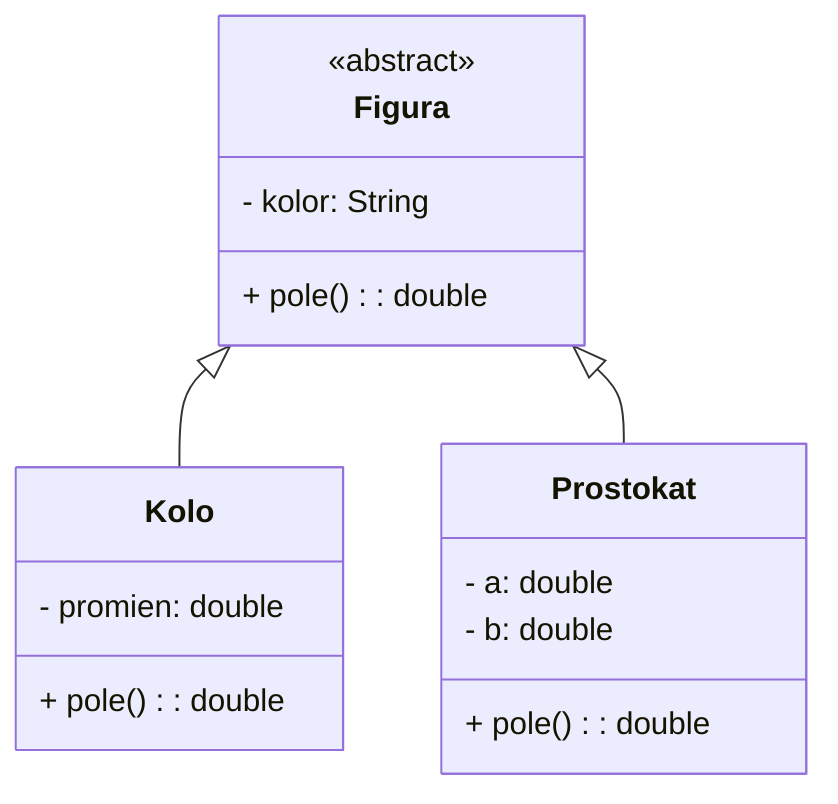

# Praca z Markdownem — sprawozdania z laboratoriów OOP (Java)

Markdown to lekki język znaczników, który pozwala na szybkie i czytelne formatowanie tekstu. Pliki Markdown mają zazwyczaj rozszerzenie `.md`.

Poniżej znajduje się praktyczny przewodnik po najważniejszych elementach Markdowna, przydatnych przy tworzeniu sprawozdań z laboratoriów OOP w Javie.

## 1. Podstawowe formatowanie tekstu

* **Nagłówki**: Używaj znaku `#`. Liczba znaków `#` odpowiada poziomowi nagłówka.
    ```markdown
    # Nagłówek poziomu 1
    ## Nagłówek poziomu 2
    ### Nagłówek poziomu 3
    ```
Tak to wygląda po użyciu w tekście:  
# Nagłówek poziomu 1
## Nagłówek poziomu 2
### Nagłówek poziomu 3  

<br>
<br>
  
* **Pogrubienie i kursywa**:
    - Pogrubienie: `**tekst**` lub `__tekst__` (np. **pogrubiony tekst**)
    - Kursywa: `*tekst*` lub `_tekst_` (np. *kursywa*)
    - Pogrubiona kursywa: `***tekst***` (np. ***pogrubiona kursywa***)
* **Listy**:
    - **Nienumerowane**: użyj `-`, `*` lub `+`.
        - Element 1
        - Element 2
    - **Numerowane**: użyj cyfry z kropką.
        1. Pierwszy element
        2. Drugi element
* **Cytaty**: Użyj znaku `>`.
    > To jest cytat.
* **Przejście do nowej linii**:
    - Aby wymusić przejście do nowej linii w tym samym akapicie, dodaj **dwie spacje** na końcu linii lub użyj znacznika `<br>`.
    - Aby zacząć nowy akapit, pozostaw jedną pustą linię między blokami tekstu.

## 2. Użycie elementów HTML

Markdown pozwala na używanie czystego kodu HTML tam, gdzie standardowa składnia jest niewystarczająca.

* **Podkreślenie tekstu**: `<u>podkreślony tekst</u>` (np. <u>podkreślony tekst</u>)
* **Wymuszone przejście do linii**: `<br>`
* **Centrowanie tekstu/obrazków**: `<center>tekst</center>`
* **Rozwijana sekcja (akordeon)**:
    ```html
    <details>
      <summary>Kliknij, aby rozwinąć</summary>
      Tutaj znajduje się ukryta treść, np. rozwiązanie zadania.
    </details>
    ```

## 3. Fragmenty kodu i komend

### Kod w linii (Inline code)
Aby umieścić krótki fragment kodu lub nazwę komendy wewnątrz zdania, otocz go pojedynczymi grawisami (backticks): `` ` ``.
Przykład: Użyj metody `toString()`, aby wypisać obiekt.

### Bloki kodu (Code blocks)
Dla dłuższych fragmentów kodu użyj potrójnych grawisów przed i po kodzie. Możesz również określić język programowania dla kolorowania składni (np. `java`, `bash`, `sql`).

#### Przykład Java (dziedziczenie + polimorfizm):
```java
abstract class Figura {
    protected String kolor;

    public Figura(String kolor) {
        this.kolor = kolor;
    }

    public abstract double pole();
}

class Kolo extends Figura {
    private double promien;

    public Kolo(String kolor, double promien) {
        super(kolor);
        this.promien = promien;
    }

    @Override
    public double pole() {
        return Math.PI * promien * promien;
    }
}

class Prostokat extends Figura {
    private double a;
    private double b;

    public Prostokat(String kolor, double a, double b) {
        super(kolor);
        this.a = a;
        this.b = b;
    }

    @Override
    public double pole() {
        return a * b;
    }
}
```

#### Przykład komendy terminala:
```bash
ls -la
```

#### Dobra praktyka w sprawozdaniu
- Podawaj tylko istotny fragment kodu (np. klasę lub metodę z zadania), a nie cały projekt.
- Nad blokiem kodu dopisz 1–2 zdania: **co ten fragment pokazuje** i **dlaczego jest ważny**.
- Po bloku kodu dodaj krótki komentarz z wynikiem działania lub wnioskiem.

## 4. Wstawianie obrazków

Składnia wstawiania obrazka jest bardzo podobna do wstawiania linku, ale zaczyna się od wykrzyknika:

``

- **Tekst alternatywny**: Wyświetla się, gdy obrazek nie może zostać załadowany.
- **Ścieżka**: Może to być ścieżka lokalna (np. `img/schemat.png`) lub adres URL.

Możesz też użyć tagu HTML ``, aby kontrolować np. szerokość obrazka:
``

Przykład:


## 5. Linki i Tabele

* **Link**: `[Nazwa wyświetlana](https://www.google.com)`  
Po użyciu: [Google](https://www.google.com)
* **Tabela**:  

| Nazwa kolumny 1 | Nazwa kolumny 2 |
|:---------------:|:---------------:|
|    Wartość A    |    Wartość B    |
|    Wartość C    |    Wartość D    |

## 6. Diagramy Mermaid (np. UML klas)

W wielu sprawozdaniach z OOP warto pokazać zależności między klasami. Możesz to zrobić przez Mermaid:



W opisie pod diagramem dopisz, co reprezentuje dziedziczenie oraz gdzie występuje polimorfizm.

## 7. Proponowany układ sprawozdania z laboratorium OOP (Java)

Możesz użyć poniższego szablonu:

```markdown
# Sprawozdanie — Laboratorium OOP w Javie

## 1. Temat i cel ćwiczenia
Krótki opis, czego dotyczyło laboratorium.

## 2. Założenia
- wymagania zadania,
- dane wejściowe/wyjściowe,
- ograniczenia.

## 3. Implementacja
### 3.1 Struktura klas
(opis + diagram Mermaid)

### 3.2 Kluczowe fragmenty kodu
(bloki `java` + komentarz)

## 4. Testy i wyniki
- przypadki testowe,
- wyniki,
- ewentualne błędy i poprawki.

## 5. Wnioski
Co działa, co można ulepszyć, czego nauczyłeś/aś się na laboratorium.
```

## 8. Eksport do PDF
### Narzędzia JetBrains (IntelliJ, PyCharm, DataGrip)
Aby przekonwertować plik Markdown na format PDF za pomocą środowisk IDE od JetBrains:

1. Otwórz plik `.md` w edytorze.
2. Upewnij się, że masz włączony podgląd Markdown (ikona dzielonego okna w prawym górnym rogu edytora).
3. Kliknij prawym przyciskiem myszy w obszarze edytora tekstu lub podglądu.
4. Wybierz opcję **Export to PDF...** (lub **Export to HTML...** jeśli wolisz format przeglądarkowy).
5. Wybierz miejsce zapisu i potwierdź.
